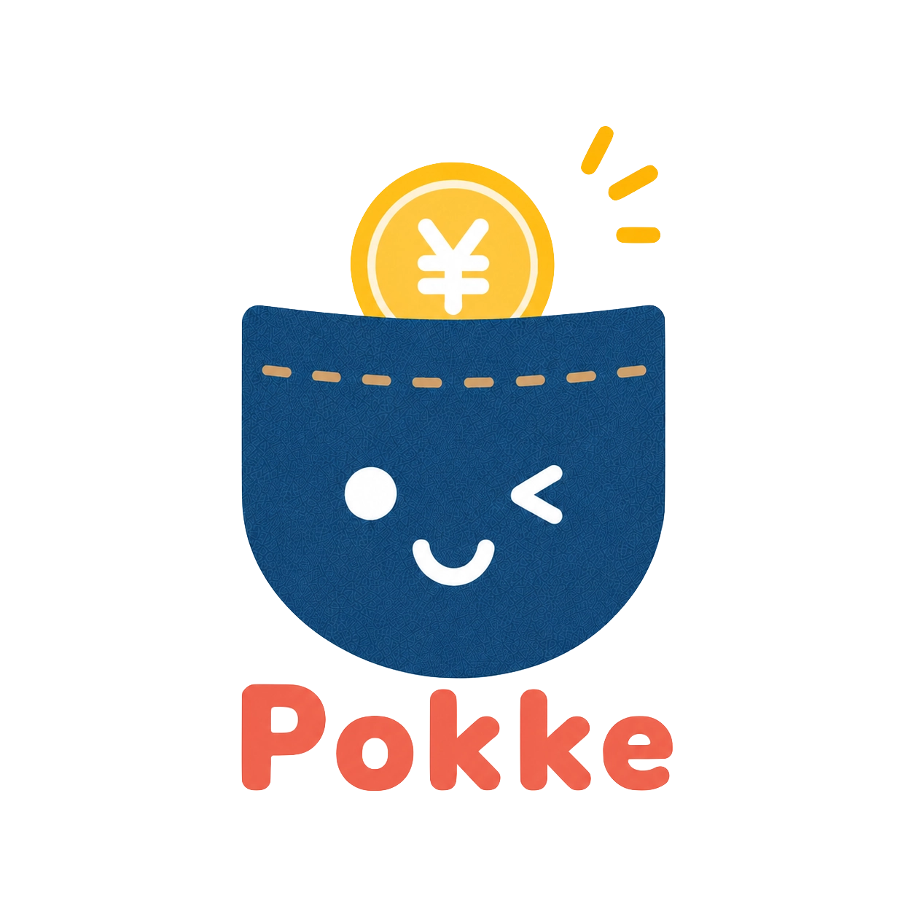
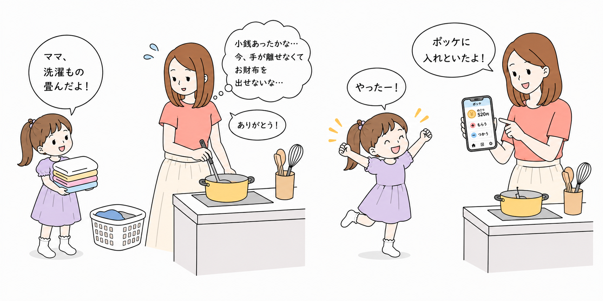
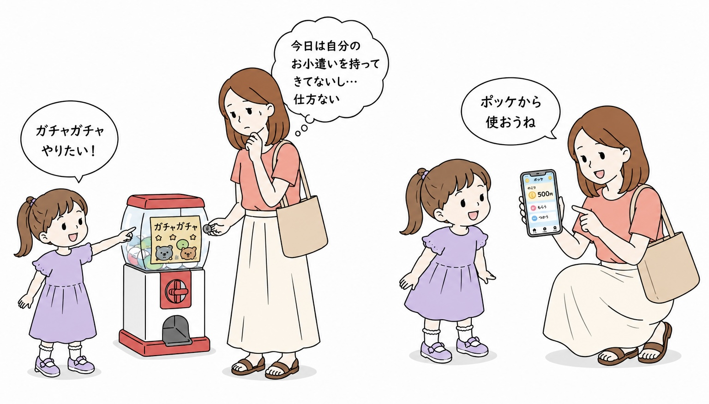
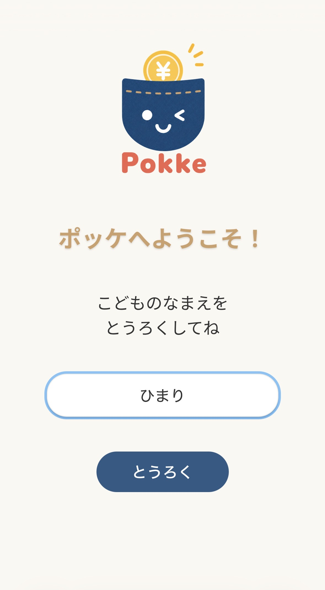
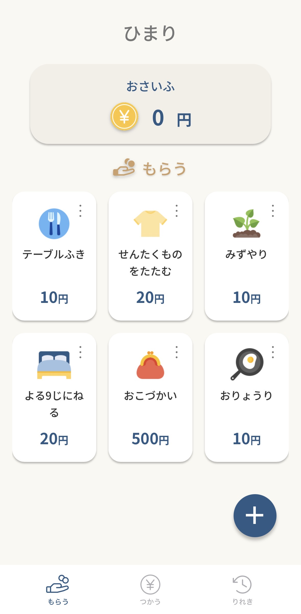
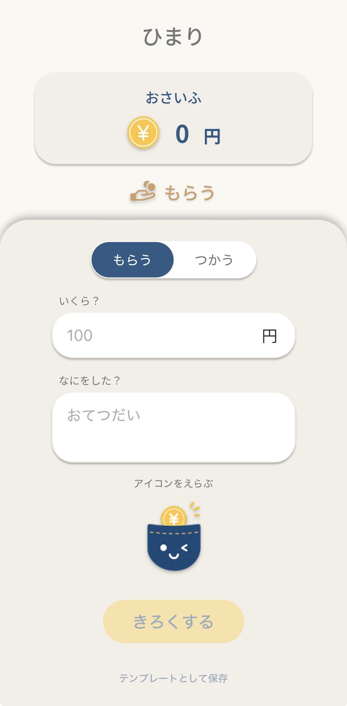
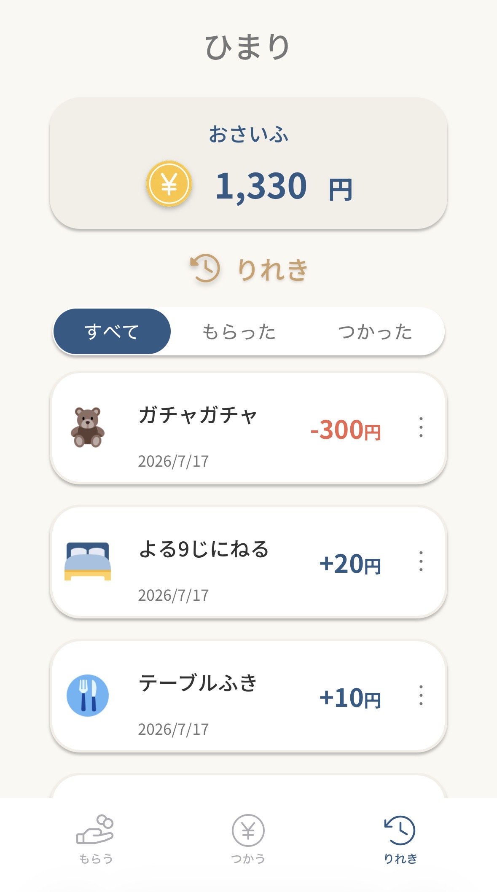
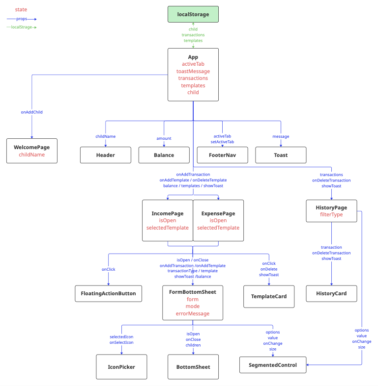

# ポッケ



子ども用バーチャルお財布アプリ

## 概要

子どもの「もらう・つかう」を、その場で記録できるバーチャルお財布アプリです。

お駄賃の現金をその場で渡せないとき、スマホですぐ記録し<br>
外出先で親が支払いを立て替えたときは、子どものお金をつかったことをその場で記録できます。<br>

アプリ名の「ポッケ」は、子どもにとって財布より身近な「ポケット」が由来です。<br>
いつでも取り出して使える手軽さで、お金のやり取りを体験できるアプリを目指しました。

## コンセプト

このアプリのゴールは、長く使い続けてもらうことではありません。<br>
子どもが自分でお財布を持って出かけるようになれば役目を終える、一時的なサポート役です。

未就学〜低学年ごろの親子を対象に<br>
金銭感覚を育む大切な数年間に寄り添える存在になることを目指しています。

## 開発背景

長女がおこづかいを始めたことが、開発のきっかけです。

お手伝いをしてくれたとき、すぐにお駄賃を渡したいと思っても、手元に小銭がないことがよくあります。

また、外出先では子どもがお財布を持ち歩いておらず、けっきょく親が買ってあげる場面も少なくありません。

「あとでね」「次からね」となってしまい、お金を**もらう・つかう体験**が曖昧になってしまうことに課題を感じていました。

そこで、現金がなくてもスマホですぐに記録できる<br>
子どものためのバーチャルお財布アプリ「ポッケ」を開発しました。


<br>


## デモ

<https://pokke-chi.vercel.app>

※ iPhoneでの利用を想定しています。

## 主な機能

- 「もらう・つかう」を記録
- 残高をバーチャルお財布として管理
- もらう・つかうテンプレートの登録
- 履歴の確認・削除
- ローカルストレージによるデータ永続化

## 画面イメージ

### 初回登録

子どもの名前を登録すると、お財布を作成できます。



### 記録する

テンプレートから選んで「もらう・つかう」を記録できます。<br>
テンプレートの追加や、自由入力による記録も可能です。

<p>
  
  
</p>

### 履歴確認

残高は画面上部に常に表示しており<br>
りれきページから履歴を確認できます。



## 使用技術

| 分類           | 技術                |
| -------------- | ------------------- |
| フロントエンド | React / TypeScript  |
| ビルドツール   | Vite                |
| スタイリング   | CSS Modules         |
| データ管理     | localStorage（MVP） |
| バージョン管理 | Git / GitHub        |
| デプロイ       | Vercel              |

## 工夫した点

#### 1. 子どもでも迷わないシンプルなUI

子どもでも直感的に操作できるよう<br>
「もらう」「つかう」「りれき」の3画面だけの構成にしました。<br>
ひらがなと漢字のバランスなど、子どもと大人の両目線からの使いやすさを意識しています。

#### 2. 「その場で記録できる」手軽さを重視

家計簿のように後から入力するのではなく<br>
その場ですぐ記録できることを最優先にしました。<br>
テンプレート機能やボトムシートにより、数タップで記録できるようにしています。

#### 3. コンポーネントの再利用を意識

SegmentedControlやBottomSheetなどは汎用コンポーネントとして実装し<br>
複数画面で再利用できる設計にしました。<br>
共通化により、保守性や拡張性を意識しています。

#### 4. MVPリリース優先

まずは小さく作ってデプロイし、実際に使いながら改善を重ねることを優先しました。<br>
そのため、MVPではデータ管理にローカルストレージを採用しています。

## 今後の展望

- Firebase Authenticationによるユーザー認証
- Firestoreへのデータ永続化
- 家族間でのお財布共有
- 複数の子どもの管理
- テンプレートの編集・並び替え
- 履歴編集
- 権限管理（親のみ入出金可能）
- PWA対応
- ごほうびアニメーション

## 設計

#### コンポーネント構成



#### ディレクトリ構成

```
src
├── assets       # 画像・アイコン
├── components   # 共通コンポーネント
├── constants    # 定数
├── pages        # 各画面
├── types        # 型定義
└── utils        # 共通処理
```
